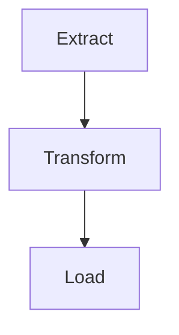

# Package
This is a Python Package for Contentdesk.io OpenData Portal

# Build package

py -m build

# Publish Test package

py -m twine upload --repository testpypi dist/*

## Test Package Install

https://test.pypi.org/project/contentdesk-opendata/0.0.1/

### Install Version
pip install -i https://test.pypi.org/simple/ contentdesk-opendata/==0.0.1

## Process

1. Extract: Get all Producs with CC-Licens
2. Transform: Convert / Transform to Schema.org JSON-LD
3. Load: View Lists by Types

